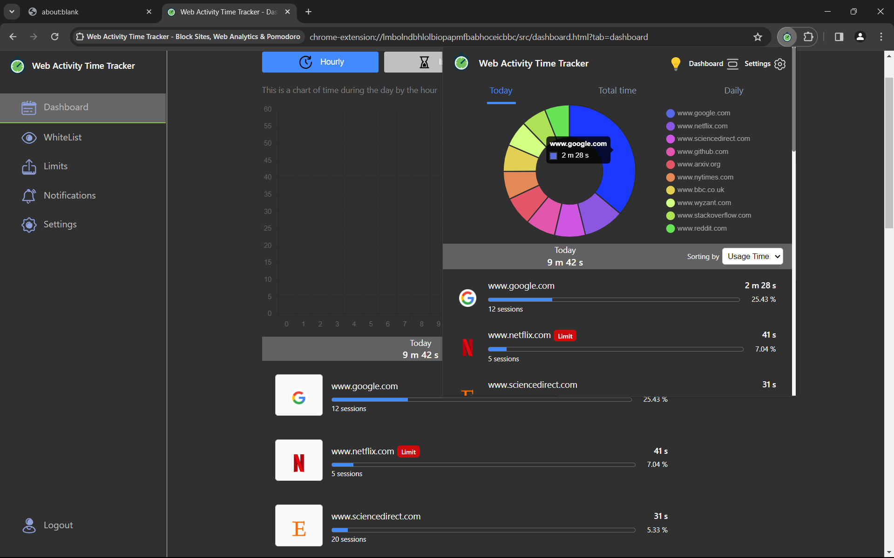
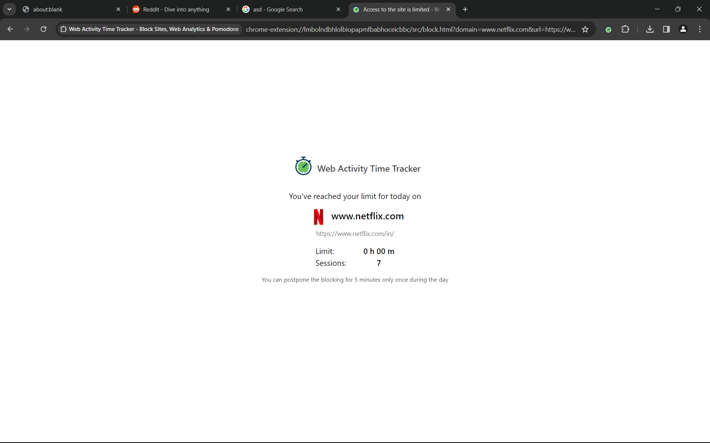

<h1>Web Activity Time Tracker</h1>

  Track and manage your web activity efficiently with the Web Activity Time Tracker. This
  productivity tool allows users to log in and monitor the time spent on various websites, offering
  insightful statistics through a dashboard. Additionally, it provides features such as
  whitelisting, blacklisting, notifications, and data export to enhance user control and
  productivity.

 Backend Availabel 

<h2>Features</h2>

<h3>Dashboard Statistics</h3>
<ul>
  <li>View detailed statistics showcasing the time spent on each website.</li>
  <li>Gain insights into your browsing habits to optimize productivity.</li>
</ul>

<h3>Whitelist</h3>
<ul>
  <li>Exclude specific websites from activity logs to focus on essential tasks.</li>
  <li>Customize whitelist settings according to your preferences.</li>
</ul>

<h3>Blacklist - Productive Browsing</h3>
<ul>
  <li>Limit the time spent on designated websites by adding them to the blacklist.</li>
  <li>Set predefined time limits to maintain control over browsing habits.</li>
</ul>

<h3>Notifications - Productive Browsing</h3>
<ol>
  <li>
    <strong>Daily Summary</strong>: Receive a daily summary of your net usage to track overall
    productivity.
  </li>
  <li>
    <strong>Custom Alerts</strong>: Set thresholds for individual websites and receive alerts when
    the set time limit is reached.
  </li>
</ol>

<h3>Data Export</h3>
<ul>
  <li>Download activity logs in CSV format for further analysis or record-keeping.</li>
</ul>

<h2>Usage</h2>
<ol>
    <li><strong>Installation</strong>: Clone the repository to your local machine using the following command:</li>
    <pre><code>git clone https://github.com/your-username/web-activity-time-tracker.git</code></pre>
    <li><strong>Setup</strong>: Navigate to the project directory and install dependencies using PNPM:</li>
    <pre><code>cd web-activity-time-tracker
pnpm install</code></pre>
    <li><strong>Configuration</strong>: Configure the application settings by modifying the configuration files located in the <code>config</code> directory. Customize settings such as whitelist, blacklist, notification preferences, and any other relevant options.</li>
    <li><strong>Start the Application</strong>: Launch the application by running the following command:</li>
    <pre><code>pnpm run start</code></pre>
    
</ol>

<h2>Contributing</h2>

  Contributions are welcome! If you have suggestions for new features, enhancements, or bug fixes,
  please open an issue or submit a pull request.

<h2>License</h2>

This project is licensed under the <a href="LICENSE">MIT License</a>.

